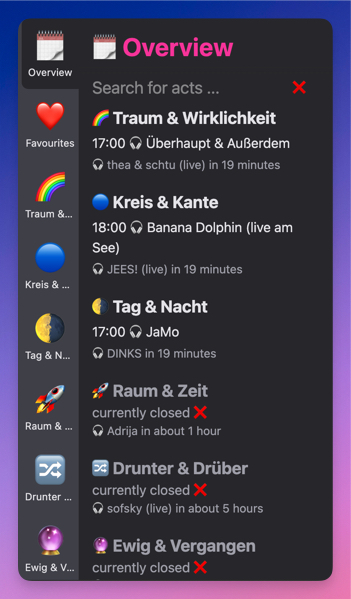

# Festival Timetable

A modern, responsive web application for displaying festival timetables for small to medium-sized festivals. Built with SvelteKit and designed for easy content management and real-time updates.



## Features

- **Real-time Schedule Display**: Shows currently playing acts and upcoming performances
- **Multi-stage Support**: Displays timetables for multiple stages with custom icons
- **Search Functionality**: Find acts quickly with fuzzy search across all stages
- **Favorites System**: Mark and track favorite acts with persistent storage
- **Admin Interface**: Content management system for easy schedule updates
- **PWA Ready**: Installable progressive web app with offline capabilities
- **QR Code Generation**: Generate QR codes for easy sharing

## Tech Stack

- **Framework**: SvelteKit 2.x with Svelte 5
- **Styling**: Tailwind CSS 4.x
- **TypeScript**: Full TypeScript support
- **PWA**: Vite PWA plugin for offline functionality
- **CMS**: Sveltia static site CMS for content management
- **Build**: Vite with SvelteKit static adapter

## Development

### Prerequisites

- Node.js (v22 or higher)
- Yarn package manager

### Getting Started

1. Clone the repository:

```bash
git clone github.com/similicious/festival-timetable
cd festival-timetable
```

2. Install dependencies:

```bash
yarn install
```

3. Start the development server:

```bash
yarn dev
```

4. Open [http://localhost:5173](http://localhost:5173) in your browser

### Available Scripts

- `yarn dev` - Start development server
- `yarn build` - Build for production
- `yarn preview` - Preview production build
- `yarn check` - Run type checking
- `yarn lint` - Check code formatting
- `yarn format` - Format code

## Content Management

The application uses Sveltia CMS for content management. Access the admin interface at `/admin` to:

- Add/edit stages and their schedules
- Set festival information

Sveltia commits directly to the Git repository via the GitHub API.
