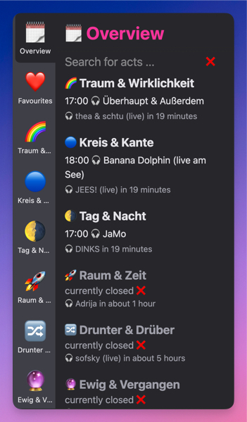

# Festival Timetable

A modern, responsive web application for displaying festival timetables for small to medium-sized festivals. Built with SvelteKit and designed for easy content management and offline support.



## Features

- **Real-time Schedule Display**: Shows currently playing acts and upcoming performances
- **Multi-stage Support**: Displays timetables for multiple stages with custom icons
- **Search Functionality**: Find acts quickly with fuzzy search across all stages
- **Favorites**: Mark and track favorite acts with persistent storage
- **CMS**: Content management system for easy schedule updates
- **PWA**: Installable progressive web app with offline support

## Tech Stack

- **Framework**: SvelteKit 2.x with Svelte 5
- **Styling**: Tailwind CSS 4.x
- **PWA**: Vite PWA plugin for offline functionality
- **CMS**: Sveltia static site CMS for content management
- **Build**: Vite with SvelteKit static adapter

## Development

### Prerequisites

- Node.js (v22 or higher)
- Yarn package manager

### Getting Started

1. Clone the repository:

```bash
git clone github.com/similicious/festival-timetable
cd festival-timetable
```

2. Install dependencies:

```bash
yarn install
```

3. Clone a timetable into `./src/lib/data/timetable`

```bash
git clone https://github.com/similicious/festival-timetable-cosy-2025 ./src/lib/data
```

4. Start the development server:

```bash
yarn dev
```

4. Open [http://localhost:5173](http://localhost:5173) in your browser

## Content Management

The application uses Sveltia CMS for content management with the timetable data located in an external repo. This allows you to grant access to third parties (e.g. event organisers) to maintain content data specifically.
Access the admin interface at `/admin` to:

- Add/edit stages and their schedules
- Set festival information

Sveltia commits directly to the Git repository via the GitHub API.

## Deployment

To build the application, both this app repo and a timetable repo need to be cloned before building. The `build` directory can be served thorugh a static hosting service.

The timetable repo URL is set through the `PUBLIC_TIMETABLE_REPO` environment variable.

```bash
export PUBLIC_TIMETABLE_REPO=https://github.com/similicious/festival-timetable-cosy-2025
chmod +x ./clone-timetable-repo.sh && ./clone-timetable-repo.sh && corepack enable && yarn && yarn build
```

## Timetable examples

- [CoSy Festival 2025](https://github.com/similicious/festival-timetable-cosy-2025)
- [Moyn Festival 2025](https://github.com/similicious/festival-timetable-moyn-2025)
